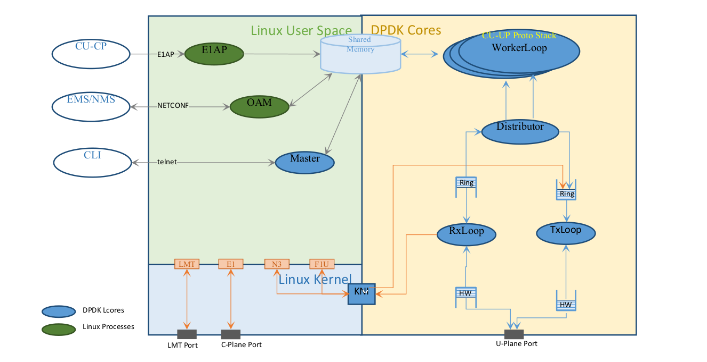

# PFM

PFM is a prototype of gNB-CU-UP a network element in teh 5G Radio Access Network. It make use of DPDK for User-Plane Packet Processing
and Includes a Platform software that can be used as a framework to build other network elements on, the platform software handles important 
features like ARP, Routing tables and multi-thread support.

## PFM Features

- ARP support for DPDK interfaces.
- KNI Integration.
- Routing tables using Longest Prefix match.
- Multi thread support using rte\_distributor.
- Communication between threads using rte\_ring structures.
- GPRS Tunneling Protocol implementation.
- CLI interface to access ARP and Routing tables.

## PFM Architecture

